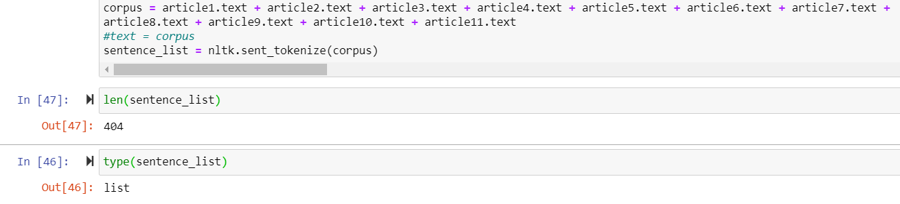
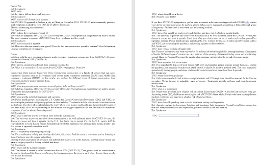
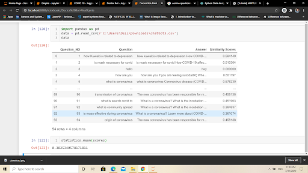
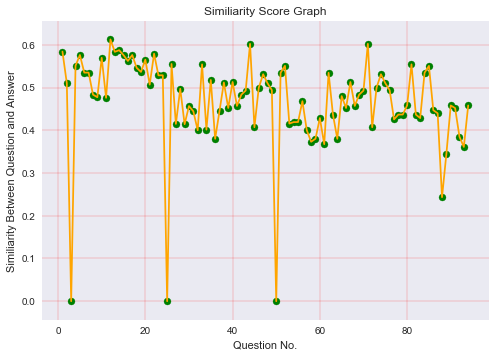

# I-CARE-MEDICAL-BOT
A chatbot which could assist people and give information related to COVID-19 pandemic, its effects on mental and physical health and activities to overcome issues anxiety and stress during this pandemic time.

## Proposed Work
1. Data Collection: The Bot collects and scrape data from various websites related to Covid-19 symptoms, consequences, mental health issues and remedies to overcome such health illness.

2. Text pre-processing: using NLTK platform to perform text processing (tokenization, parsing, classification, stemming, tagging and normalization).

3. Text vectorization: Machine Learning based vectorization of processed sentence list using Counter_Vectorizer

4. Similarity metric analysis: Evaluating the similarity between the user input and Bot response using Cosine_Similarity() metric. 

5. Testing: Regressively test the performance of the BOT responses.

6. Result visualization: Plotting the graph for gross similarity measure of the BOT.

## Total length of our dataset: 
404 sentences (Storage type=list)

Figure 1: Length of Data Collected

## Implementation & Results:

Figure 2: Conversation with the bot 

## Bot Analysis:
Gross Similarity : 47.5%

Figure 3: Cosine similarity between the user questions and Bot response

Figure 4: Cosine Similarity Plot

